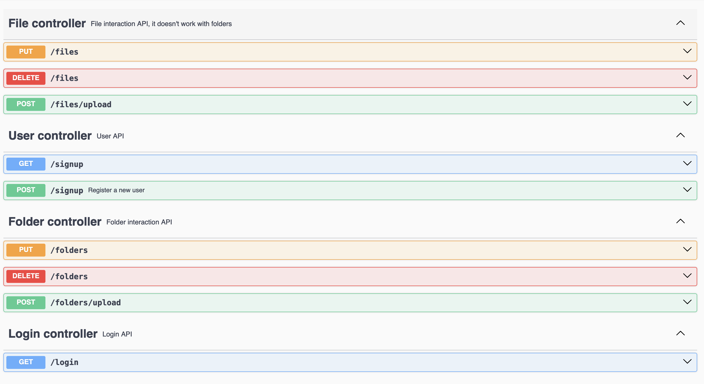

# cloud-storage (Still in development)

[EN](#english-version) | [RU](#русская-версия)

## English Version

## Description
(In development stage)

Cloud file storage. It's a multiuser web-application on Spring Boot. Feel free to
proceed basic operations with files and folders in cloud-storage: Upload,
rename, delete

## Sequence diagram

## Component diagram

## End-points

## Tech stack

### Back-end:

- Java 17
- Spring Boot 3.2.5:
    * Web
    * Security
    * Session
    * Data JPA
- Thymeleaf
- PostgreSQL

### Front-end:

- HTML
- CSS
- Bootstrap
- JavaScript

### Testing:
- JUnit 5
- Testcontainers
- Mockito

### Deploy
- Docker

## Implementation

DDD pattern

## Installation and Running

In progress

## Authors

Author: Darfik43

## Contact

darfik43@gmail.com

## Русская версия

# cloud-storage

## Описание

(В разработке)

Облачное хранилище файлов. Многопользовательское веб-приложение построенное с использованием
Spring boot. На данный момент обладает всей базовой функциональностю облака: 
загрузить, переименовать, удалить

## Диаграмма последовательности

## Диаграмма компонентов

## Энд-поинты API

## Стэк технологий

### Back-end:

- Java 17
- Spring Boot 3.2.5:
    * Web
    * Security
    * Session
    * Data JPA
- Thymeleaf
- JUnit
- PostgreSQL

### Front-end:

- HTML
- CSS
- Bootstrap
- JavaScript

### Testing:
- JUnit 5
- Testcontainers
- Mockito

### Deploy

- Docker

## Реализация

Шаблон DDD

## Установка и запуск
В разработке

## Автор

Darfik43

## Контакты

darfik43@gmail.com
